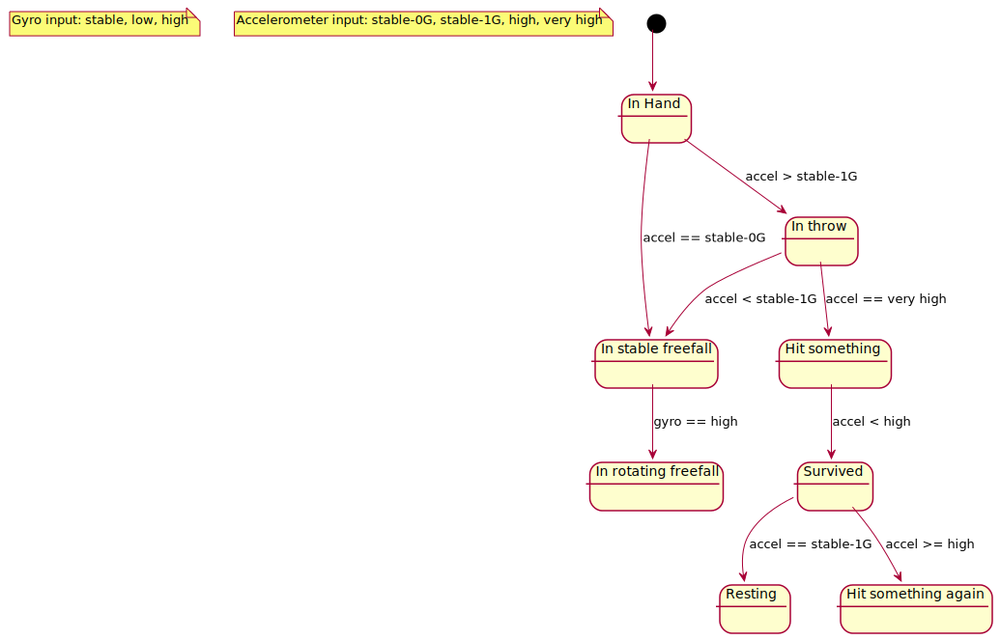

= The Most Expensive Game

Price: free

== pricing (score multipiler)

check for price of device (ebay?), draw on screen

needs backend?

== advertisements

sell space for repair shop advertisements and cases - needs backend?

== device inputs

using fuzzy logic

gyroscope: stable, low, high
using gyroscope angular difference between frames normalized to second
with low pass filter?

accelerometer: stable-1G, stable-0G, high, very high
using magnitude of acceleration vector without 

== device states

resting
:   after (in hand) or (in throw) or (freefall), accelerometer stable 1G, gyroscope stable

in hand
:   accelerometer stable 1G, gyroscope instable   

freefall
:   accelerometer stable 0G, gyroscope semi-stable

freefall-rotating
:   accelerometer stable 0G, gyroscope high

in throw
:   accelerometer high, was in hand

hit something
:   accelerometer very high, was in freefall or freefall rotating
    can detect how hard it hit?

survived
:   after (hit something) and accelerometer stable 1G, gyroscope stable

== sounds

device taunting to throw it

=== in hand:

"I'm not afraid"

"do it"

"I know you want to"

=== freefall:

"I regret nothing!"

"nooooooooooo"

=== freefall rotating

* "aaaaaaaaaaaaa"

=== survived

* "haha!"
* "(android turn on sound cut short), nah, just kidding"
* "let's do it again!"

== achievements

How will they be stored? google play games? facebook?

- no cussion! - hit very hard
- do a barrel roll! - rotated a lot (5*360?) 
- I want a new phone - survived 10 hits
- I throw junk - threw a cheap device (<150$) 5 times
- I'm prosperous - threw a expensive device 5 times (>300$)

== high scores

Some kind of high scores?

- time in freefall
- number of rotations
- most expensive device to be thrown
- cheapest device to be thrown

With specifying device

== Graphics

Minimalistic, a rotating background with gyroscope so players can see rotation.

Sometimes draw a crack on screen. 

Available gyro rotation total deg/sec and accelerometer magnitude graphs

Always in portrait

== Instructions

Throw your phone or tablet as far up as you can.
Let it fall.
Let it rotate.
Let it crash.
Impress your friends!
Don't sue me, you're responsible for playing.
Throw to start.

Got a repair shop? This is the
best place to advertise it :)