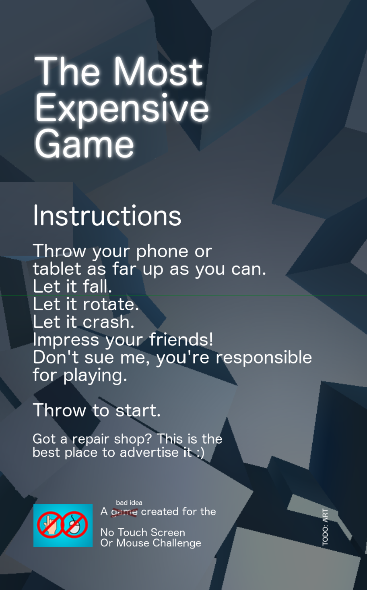

The Most Expensive Game
=======================

A test of an old idea that the [No Touch Screen Or Mouse Challenge](https://itch.io/jam/no-touch-screen-chalange/rate/86591) made me remember. Maybe also taking the "no touch screen" part too causatively.

This game might be very expensive is you not play it safe. Please remember you broke your device, I merely measured this act.

Please post comments of your records with device type. Never got the time to implement any spyware.

This is a **PROTOTYPE of a game**, so It can damage the device. Well, you will damage it yourself and I'm not intending on fixing the damage the device part, but you know, just FYI.

Game released on 2016-09-20.
[Android binaries are available](https://chanibal.itch.io/the-most-expensive-game) (13MB)

Design docs
-----------

Design docs are a mess that is [available here](Docs/design.adoc).  
Please note, that they were not implemented in full.

Asset sources
-------------

- skyboxes by: [sky5x one by RKD](https://assetstore.unity.com/packages/2d/textures-materials/sky/sky5x-one-6332)
- application icon (used): [PublicDomainPictures](https://pixabay.com/en/broken-cell-phone-cellular-72161/)
- application icon (unused, but in assets): [Webalys](https://www.iconfinder.com/icons/185091/danger_death_delete_destroy_skull_streamline_icon#size=128)

License
-------

[MIT](LICENSE)
